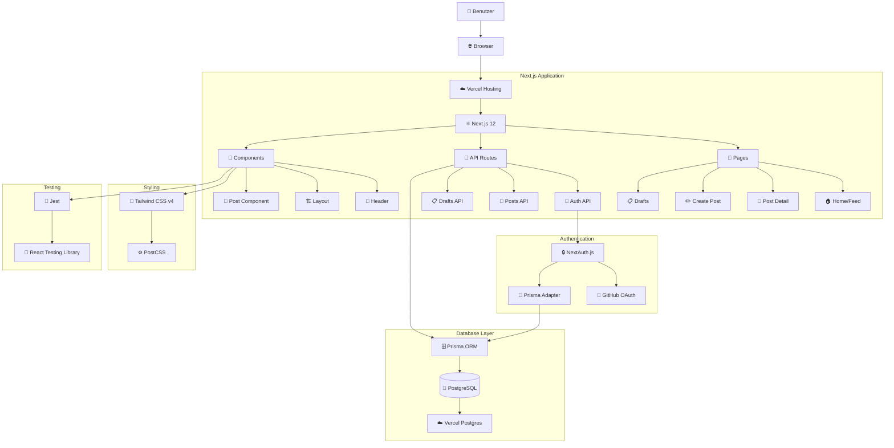
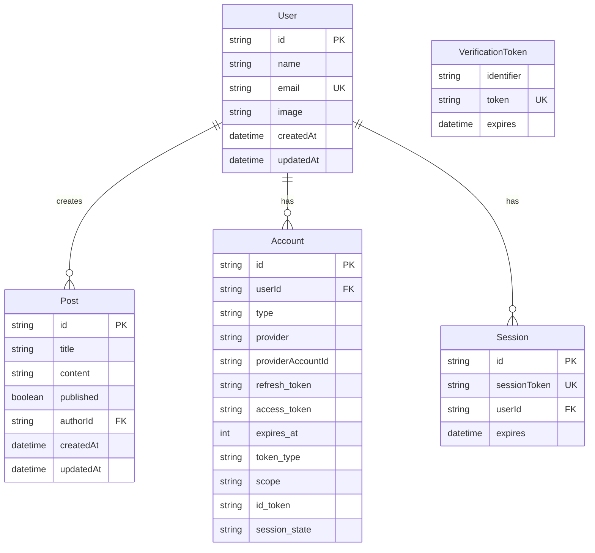
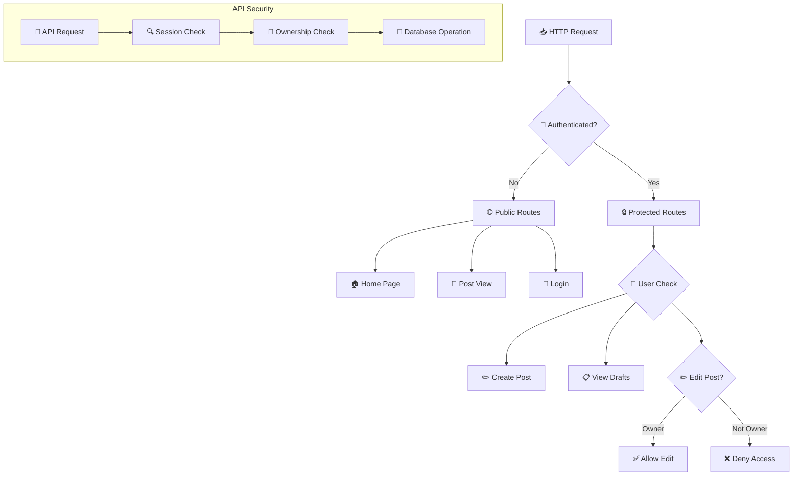
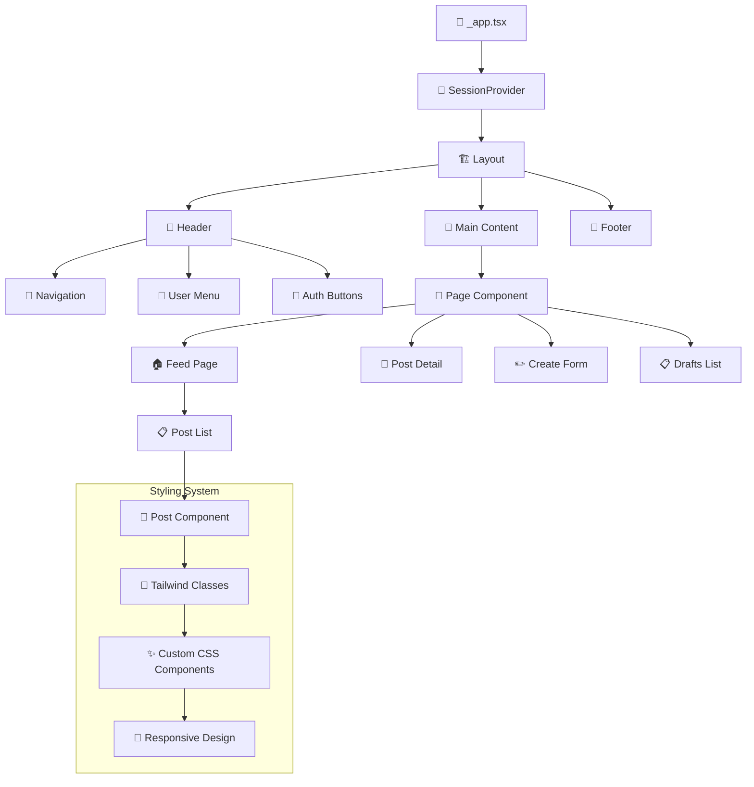
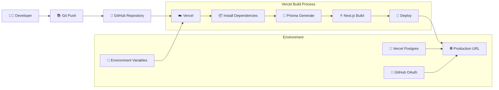

# Architektur der Next.js Blog-Anwendung

## Systemübersicht

```mermaid
flowchart TB
    User[👤 Benutzer] --> Browser[🌐 Browser]
    Browser --> Vercel[☁️ Vercel Hosting]
    
    subgraph "Next.js Application"
        Vercel --> NextJS[⚛️ Next.js 12]
        NextJS --> Pages[📄 Pages]
        NextJS --> API[🔌 API Routes]
        NextJS --> Components[🧩 Components]
        
        Pages --> Home[🏠 Home/Feed]
        Pages --> Post[📝 Post Detail]
        Pages --> Create[✏️ Create Post]
        Pages --> Drafts[📋 Drafts]
        
        API --> AuthAPI[🔐 Auth API]
        API --> PostsAPI[📄 Posts API]
        API --> DraftsAPI[📋 Drafts API]
        
        Components --> Header[🧭 Header]
        Components --> Layout[🏗️ Layout]
        Components --> PostComp[📄 Post Component]
    end
    
    subgraph "Authentication"
        AuthAPI --> NextAuth[🔒 NextAuth.js]
        NextAuth --> GitHub[🐙 GitHub OAuth]
        NextAuth --> PrismaAdapter[🔗 Prisma Adapter]
    end
    
    subgraph "Database Layer"
        API --> Prisma[🗄️ Prisma ORM]
        PrismaAdapter --> Prisma
        Prisma --> PostgreSQL[(🐘 PostgreSQL)]
        PostgreSQL --> VercelDB[☁️ Vercel Postgres]
    end
    
    subgraph "Styling"
        Components --> Tailwind[🎨 Tailwind CSS v4]
        Tailwind --> PostCSS[⚙️ PostCSS]
    end
    
    subgraph "Testing"
        Components --> Jest[🧪 Jest]
        Jest --> RTL[🔬 React Testing Library]
    end
```

## Datenmodell

```mermaid
erDiagram
    User ||--o{ Post : creates
    User ||--o{ Account : has
    User ||--o{ Session : has
    
    User {
        string id PK
        string name
        string email UK
        string image
        datetime createdAt
        datetime updatedAt
    }
    
    Post {
        string id PK
        string title
        string content
        boolean published
        string authorId FK
        datetime createdAt
        datetime updatedAt
    }
    
    Account {
        string id PK
        string userId FK
        string type
        string provider
        string providerAccountId
        string refresh_token
        string access_token
        int expires_at
        string token_type
        string scope
        string id_token
        string session_state
    }
    
    Session {
        string id PK
        string sessionToken UK
        string userId FK
        datetime expires
    }
    
    VerificationToken {
        string identifier
        string token UK
        datetime expires
    }
```

## Sicherheitsarchitektur

```mermaid
flowchart TD
    Request[📥 HTTP Request] --> Auth{🔐 Authenticated?}
    
    Auth -->|No| Public[🌐 Public Routes]
    Auth -->|Yes| Protected[🔒 Protected Routes]
    
    Public --> HomePage[🏠 Home Page]
    Public --> PostView[📖 Post View]
    Public --> Login[🚪 Login]
    
    Protected --> AuthCheck{👤 User Check}
    AuthCheck --> CreatePost[✏️ Create Post]
    AuthCheck --> Drafts[📋 View Drafts]
    AuthCheck --> EditPost{✏️ Edit Post?}
    
    EditPost -->|Owner| Allow[✅ Allow Edit]
    EditPost -->|Not Owner| Deny[❌ Deny Access]
    
    subgraph "API Security"
        APIReq[🔌 API Request] --> SessionCheck[🔍 Session Check]
        SessionCheck --> OwnershipCheck[👑 Ownership Check]
        OwnershipCheck --> DBOperation[💾 Database Operation]
    end
```

## Komponentenarchitektur

```mermaid
flowchart TB
    App[📱 _app.tsx] --> SessionProvider[🔐 SessionProvider]
    SessionProvider --> Layout[🏗️ Layout]
    
    Layout --> Header[🧭 Header]
    Layout --> Main[📄 Main Content]
    Layout --> Footer[🦶 Footer]
    
    Header --> Navigation[🧭 Navigation]
    Header --> UserMenu[👤 User Menu]
    Header --> AuthButtons[🔐 Auth Buttons]
    
    Main --> PageComponent[📄 Page Component]
    
    PageComponent --> Feed[🏠 Feed Page]
    PageComponent --> PostDetail[📝 Post Detail]
    PageComponent --> CreateForm[✏️ Create Form]
    PageComponent --> DraftsList[📋 Drafts List]
    
    Feed --> PostList[📋 Post List]
    PostList --> PostComponent[📄 Post Component]
    
    subgraph "Styling System"
        PostComponent --> TailwindClasses[🎨 Tailwind Classes]
        TailwindClasses --> CustomCSS[✨ Custom CSS Components]
        CustomCSS --> ResponsiveDesign[📱 Responsive Design]
    end
```

## Deployment-Pipeline

```mermaid
flowchart LR
    Developer[👨‍💻 Developer] --> Git[📚 Git Push]
    Git --> GitHub[🐙 GitHub Repository]
    GitHub --> Vercel[☁️ Vercel]
    
    subgraph "Vercel Build Process"
        Vercel --> InstallDeps[📦 Install Dependencies]
        InstallDeps --> PrismaGen[🔧 Prisma Generate]
        PrismaGen --> NextBuild[⚛️ Next.js Build]
        NextBuild --> Deploy[🚀 Deploy]
    end
    
    Deploy --> Production[🌐 Production URL]
    
    subgraph "Environment"
        EnvVars[🔐 Environment Variables] --> Vercel
        Database[🐘 Vercel Postgres] --> Production
        GitHubOAuth[🔑 GitHub OAuth] --> Production
    end
```